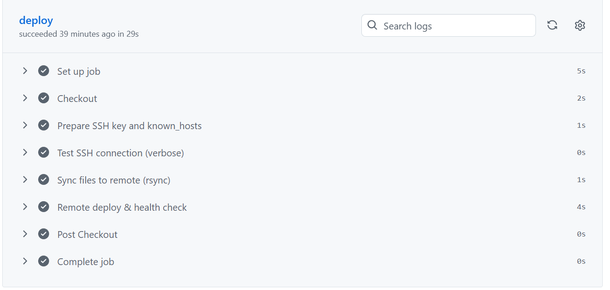
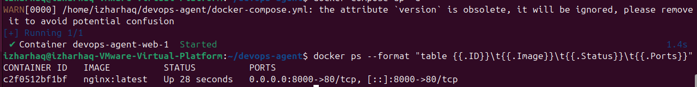

# 🚀 DevOps Agent – CI/CD Showcase

## Overview
This repository demonstrates my DevOps automation expertise — including CI/CD pipelines, GitHub Actions, and deployment workflows. It is designed as part of my professional portfolio for Upwork and other freelancing platforms.

## ⚙️ Tech Stack
- **CI/CD:** GitHub Actions  
- **Containerization:** Docker  
- **Orchestration:** Kubernetes (optional for future scaling)  
- **Backend Framework:** FastAPI  
- **Version Control:** Git & GitHub  
- **Automation:** YAML-based workflows and self-hosted runners

## 🧩 Workflow Highlights
- **Build & Test:** Automatically validates code, dependencies, and syntax.  
- **Deploy (Self-Hosted):** Uses a self-hosted runner to simulate production deployment.  
- **Post-Deploy Health Check:** Confirms the deployed service is running as expected.  
- **Rollback Safety:** Backup workflows allow quick restoration if deployment fails.

## ✅ Deployment Verification
- CI/CD pipeline successfully deployed via GitHub Actions (Self-Hosted Runner)
- Verified Nginx container running on port 8000
- Health check confirmed: **OK**
- Remote deploy & health check completed without errors

## 📸 Screenshots

**1. CI/CD Workflow Success**

**2. Running Nginx Container**

**3. Docker Compose Success**

